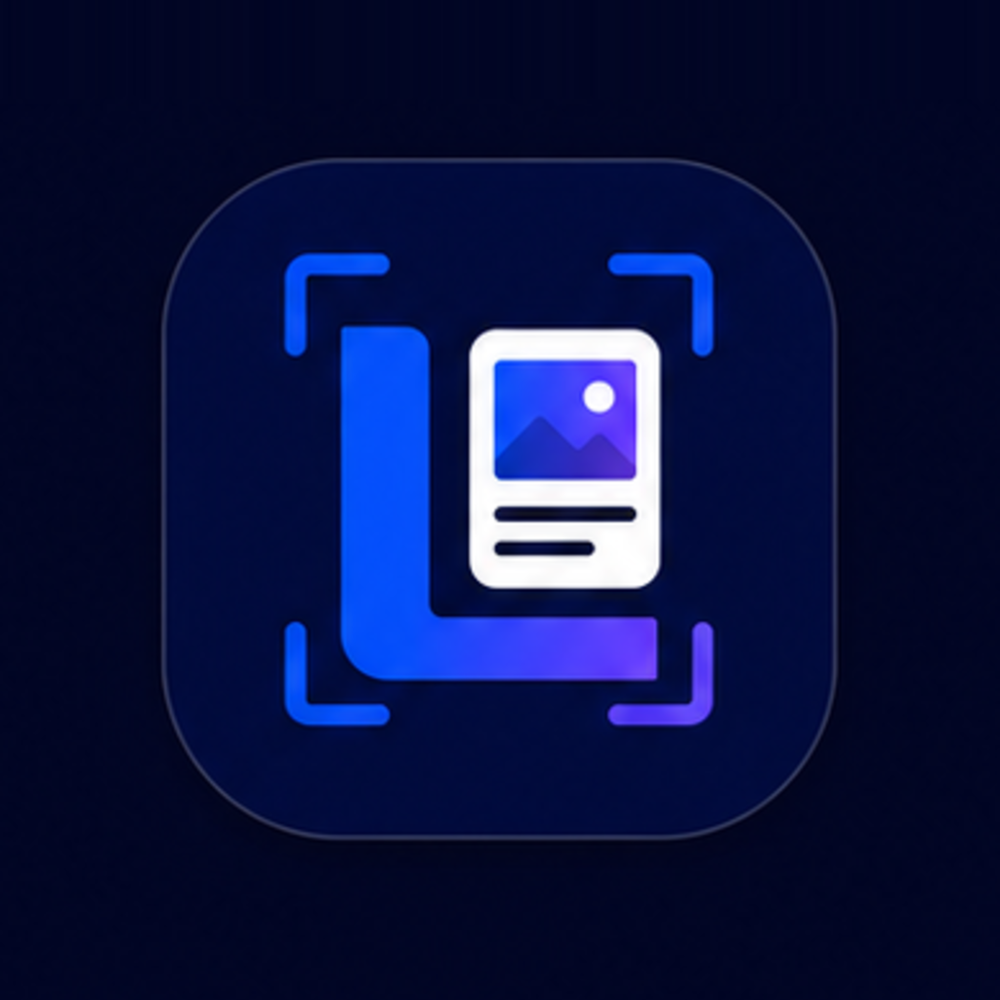
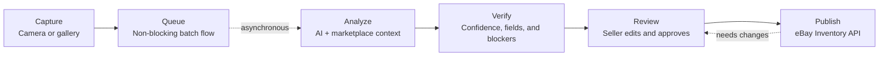
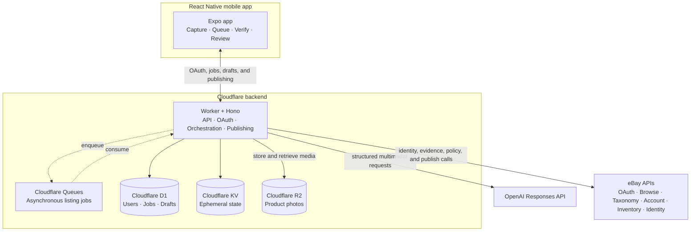

<div align="center">

<!-- CURRENT-STATE-AUTHORITY -->
> **Accuracy note, July 21, 2026:** The verified core is the camera-to-reviewed-fixed-price-eBay workflow. RevenueCat still requires store transaction proof, and the deployed Market API is currently blocked. See [Current Implementation State](docs/CURRENT_STATE.md) for the authoritative implementation and deployment snapshot.



# ListingOS

**Product photos to review-ready eBay drafts.**

AI-powered, marketplace-verified, and deliberately seller-first — photo-to-listing automation, not template filling, manual data entry, or copy-and-paste workflows.

[](LICENSE)
[](package.json)
[](CONTRIBUTING.md)

[Live demo](https://listingos.expo.app) ·
[Devpost project](https://devpost.com/software/listingos) ·
[Documentation](docs/README.md) ·
[Support](https://seller-ai-platform.jonathang132298.workers.dev/app-support) ·
[Privacy](https://seller-ai-platform.jonathang132298.workers.dev/privacy)

</div>

ListingOS is a camera-first AI seller agent for eBay. Capture or upload product photos, let the app identify the item, generate a structured listing draft, price it using marketplace evidence, surface the fields and blockers that need seller attention, and publish from a single review screen.

The goal is simple: make listing inventory feel as fast as posting a story. This repository contains the Expo React Native application and its Cloudflare Worker backend.

> ListingOS is an independent project and is not affiliated with or endorsed by eBay.

## How It Works




1. **Capture** a product with the device camera or import existing photos.
2. **Queue** multiple products without waiting for earlier drafts to finish.
3. **Analyze** the photos using AI, product evidence, and marketplace context.
4. **Verify** identity, category, required item specifics, pricing support, and publish blockers.
5. **Review** the generated listing, resolve warnings, and edit any field.
6. **Publish** through eBay only after explicit seller approval.

The queue is deliberately non-blocking. A seller can continue capturing inventory while earlier products upload, analyze, and move toward review.

## Current MVP

ListingOS currently supports:

- eBay OAuth for multiple sellers
- camera capture and gallery import
- single-product and multi-product photo batches
- asynchronous AI draft generation through Cloudflare Queues
- AI-generated titles, category suggestions, condition notes, descriptions, item specifics, and pricing options
- marketplace enrichment through eBay Browse, Taxonomy, Account, Inventory, and Identity APIs
- seller-readiness checks and actionable publish blockers
- optimistic upload, autosave, blocker resolution, and publish-state UI
- direct fixed-price publishing through the eBay Inventory API
- fixture-backed, non-mutating demo flows for judging and product review

<details>
<summary><strong>Specialized and advanced capabilities</strong></summary>

- Graded trading-card safeguards, including PSA certificate verification, anchored Pokémon catalog lookup, eBay image-search comparables, and strict comparable filtering
- OfferUp local asking-price signals for additional seller context without weakening eBay-led publish safety
- A deterministic Opportunity Score on the review page, adapted from the original web prototype
- Native capture-quality checks for blur, exposure, and visual detail that never block the listing pipeline
- Sony monitor-mode import that automatically groups photos captured during the same camera session
- An AI-generated image-enhancement plan that describes recommended edits without modifying the original media
- Public image delivery from Cloudflare R2 through the Worker during capture, analysis, and review

</details>

## Non-Mutating Demo Mode

ListingOS includes a fixture-backed demonstration mode for OpenAI Build Week judging and other controlled product reviews.

It provides three representative workflows:

- an illustrative general-merchandise review paired with stored historical publish evidence
- a graded-card example that locks weak pricing instead of presenting unsupported confidence
- a blocker-repair example that converts a raw marketplace error into a concrete resolution path

This allows a reviewer to understand the complete capture-to-review experience without connecting a seller account or risking a live eBay mutation.

Proof mode is disabled by default. Enable it only in a dedicated demo build:

```bash
EXPO_PUBLIC_PROOF_MODE=true
```

## Architecture



| Layer | Technology |
| --- | --- |
| Mobile | Expo SDK 57, React Native, Expo Router |
| Client state | TanStack Query, Zod, SecureStore, AsyncStorage |
| API | Cloudflare Workers with Hono |
| Database | Cloudflare D1 |
| Media | Cloudflare R2 |
| Ephemeral state | Cloudflare KV |
| Background work | Cloudflare Queues |
| AI | OpenAI Responses API |
| Marketplace | eBay OAuth, Browse, Taxonomy, Account, Inventory, and Identity APIs |

### Media lifecycle

Product photos are stored in Cloudflare R2 and served through the Worker during capture, analysis, and review.

Before publication, finalized listing media is ingested through eBay's Media API. Buyer-facing listings therefore do not depend on application-hosted Worker image URLs remaining accessible.

## How OpenAI Is Used

GPT-5.6 is used through the OpenAI Responses API in the Worker draft-generation pipeline.

The model receives product photos together with marketplace context and returns strict, structured listing intelligence, including:

- title options
- product category
- condition observations
- listing description
- item specifics
- product identifiers
- pricing context and strategy
- missing information
- confidence signals
- predicted publish blockers

A second high-detail structured pass is used when card-label OCR is required.

The Worker validates model output before persistence, reconciles it with eBay data and vertical-specific evidence, and refuses to trust graded-card pricing when product identity or comparable evidence is weak.

The model never publishes a listing directly. Every listing must pass backend validation and receive explicit seller approval before a marketplace mutation is attempted.

## Known MVP Limitations

ListingOS is a working MVP, not a finished multi-marketplace production platform.

### Marketplace and pricing

- Auction publishing is represented in shared contracts, but the proven publishing adapter currently supports fixed-price Inventory API listings.
- Pricing uses active eBay Browse API comparables, including image search for cards. It does not currently use sold-item data or a calibrated time-to-sale model.
- eBay is the only verified external publish channel. An experimental ListingOS Market
  public feed/detail and seller-controlled beta publish surface exists, but buyer inquiry is
  controlled-demo-only; email delivery and the native seller inbox/reply flow are not shipped.

### Media and background execution

- AI produces an image-enhancement plan, but the app does not currently generate transformed image variants.
- Photo transfer continues while the application process remains alive. Uploads do not yet resume after the operating system terminates the app.
- Sony support is import-only. Tethered remote-camera control exists in the capture-source contract but is explicitly disabled.

### Testing and native intelligence

- Full automated marketplace end-to-end coverage is still being added. Current gates include strict lint and type checks, Expo Doctor, Worker dry runs, web export verification, Android production exports, and physical-device testing.
- The release build currently performs photo-quality scoring on-device. A YOLOX object-detection runtime exists in the repository but is not included in Android release builds.

## Quick Start

### Prerequisites

- Node.js compatible with Expo SDK 57
- Android Studio and the Android SDK for local Android builds
- A Cloudflare account with Workers, D1, KV, R2, and Queues
- OpenAI and eBay sandbox or production credentials
- Wrangler authenticated with `npx wrangler login`

### Install and validate

```bash
npm install
npm run check
```

### Run the mobile app

The default client configuration points to the deployed Worker defined in `src/config/app.ts`.

> Publishing is a live marketplace mutation. Use proof mode or a dedicated development Worker for routine UI testing.

Start the Expo development-client server:

```bash
npm run dev
```

Use tunnel mode when the test device cannot reach the development server over the local network:

```bash
npm run dev:tunnel
```

For a direct native Android build:

```bash
npm run android
```

An optional build-time API override can be placed in `.env`:

```bash
EXPO_PUBLIC_API_BASE_URL=https://your-worker.example.workers.dev
```

There is intentionally no backend URL input in the seller-facing UI.

### Run the Worker locally

```bash
cp .dev.vars.example .dev.vars
npm run db:migrate:local
npm run worker:dev
```

Local Worker execution is useful for route development and isolated backend testing.

OAuth callbacks, public media reachability, Cloudflare Queues, and real eBay publishing should be verified against a deployed Worker.

<details>
<summary><strong>Optional: RevenueCat payment-flow testing</strong></summary>

RevenueCat payment checks require a native development-client build and do not run in Expo Go.

Before testing, ensure `.env` includes:

```bash
EXPO_PUBLIC_REVENUECAT_MODE=test
EXPO_PUBLIC_REVENUECAT_TEST_API_KEY=...
```

</details>

## Repository Layout

```text
src/
  app/                 Expo Router routes
  components/          Reusable UI and app-shell primitives
  config/              Non-secret mobile configuration
  hooks/               App-level lifecycle and navigation hooks
  lib/                 API client, storage, query, and haptic utilities
  screens/             Capture, queue, and listing-review screens
  shared/              Zod schemas shared by mobile and Worker
  theme/               Colors and gradients

worker/
  migrations/          D1 schema migrations
  index.ts             HTTP routes, queue consumer, AI, and eBay orchestration
  types.ts             Cloudflare bindings and database row types

docs/
  README.md            Role-based documentation map

assets/
  proof-mode/          Runtime fixtures for non-mutating demo flows

ListingOS-Hackathon-Demo-Assets/
  README.md            Local video workbench and reproducible demo sources
```

## Common Commands

### Application and validation

| Command | Purpose |
| --- | --- |
| `npm run dev` | Start one clean Expo development-client server |
| `npm run dev:tunnel` | Start the development client in tunnel mode with a cleared cache |
| `npm run android` | Build and run the native Android application |
| `npm run lint` | Run ESLint using the Expo flat configuration |
| `npm run check:docs` | Verify every tracked local Markdown link |
| `npm run typecheck` | Check the mobile and Worker TypeScript projects |
| `npm run doctor` | Run Expo dependency and configuration diagnostics |
| `npm run check` | Run the standard local validation gate |
| `npm run web:verify` | Run application checks, a Worker dry run, and the production web export |
| `npm run verify:submission` | Run application checks, a Worker dry run, and the Android production export |

### Builds and releases

| Command | Purpose |
| --- | --- |
| `npm run export:android` | Produce a production Android JavaScript export |
| `npm run export:updates` | Validate iOS and Android OTA bundles locally |
| `npm run eas:update:preview -- --message "description"` | Publish an OTA update to preview testers |
| `npm run eas:update:production -- --message "description"` | Publish an approved OTA update to production |
| `npm run build:android:release` | Build the standalone Android release APK |
| `npm run install:android:release` | Install the standalone APK on a connected Android device |
| `npm run open:android` | Launch the installed ListingOS application |
| `npm run web:serve` | Serve the exported production web application locally |

### Worker and data

| Command | Purpose |
| --- | --- |
| `npm run worker:dev` | Start the Worker locally on port 8787 |
| `npm run worker:check` | Type-check and dry-run bundle the Worker |
| `npm run worker:deploy` | Type-check and deploy the Worker |
| `npm run worker:tail` | Stream logs from the deployed Worker |
| `npm run db:migrate:local` | Apply D1 migrations to the local database |
| `npm run db:migrate:remote` | Apply D1 migrations to the configured remote database |

## Documentation

### Start here

- [Documentation index](docs/README.md)
- [Operations and deployment](docs/OPERATIONS.md)
- [Release and device validation](docs/RELEASE.md)

### Submission and claim evidence

- [Devpost submission package](docs/DEVPOST_SUBMISSION.md)
- [Final submission checklist](docs/SUBMISSION_CHECKLIST.md)
- [MVP final cut](docs/MVP_FINAL_CUT_2026-07-21.md)
- [Public claims and supporting evidence](docs/CLAIMS.md)
- [Demo workbench](ListingOS-Hackathon-Demo-Assets/README.md)

### Store review and user-facing policy

- [App-store copy](docs/APP_STORE_COPY.md)
- [Privacy documentation](docs/PRIVACY.md)
- [Support documentation](docs/SUPPORT.md)

### Forward-looking plans

- [Product roadmap](docs/ROADMAP.md)
- [ListingOS Market execution plan](docs/LISTINGOS_MARKETPLACE_PLAN.md)

Present-tense public claims should remain within the evidence documented in `docs/CLAIMS.md`. Future capabilities and unbuilt plans should remain in roadmap and planning documents.

## Project Provenance

ListingOS began as a private Next.js prototype focused on post-listing audits and recommendation workflows.

For OpenAI Build Week, the project evolved into the current mobile-first Expo and Cloudflare architecture. The most useful deterministic auditing concept from the original prototype was adapted into the mobile review experience as the Opportunity Score.

## How Codex Was Used

ListingOS was developed through an iterative Codex-assisted workflow.

Codex supported repository creation, Expo and Cloudflare implementation, Android build-debug loops, eBay integration wiring, public image-delivery fixes, documentation, and device validation.

Product direction, seller-workflow requirements, visual design, marketplace-account decisions, and final validation remained owner-directed.

## Verified Submission Evidence

At submission time:

- The deployed Worker health endpoint reported OpenAI, eBay, D1, R2, and Queue configuration as healthy.
- The fixed-price publishing path produced real eBay listing and offer identifiers through the Inventory API.
- Listing media was ingested through eBay's Media API before publication, preventing inaccessible application URLs from becoming broken buyer-facing images.
- Android and web production exports built successfully.
- Native Android release testing was documented in [Release and device validation](docs/RELEASE.md).
- Exact public-claim wording and its supporting evidence were recorded in [Public claims and supporting evidence](docs/CLAIMS.md).

## Security

- Never expose OpenAI, eBay client, encryption, or backend secrets through `EXPO_PUBLIC_*` variables.
- Mobile seller sessions are stored in Expo SecureStore.
- eBay access and refresh tokens are encrypted before D1 persistence.
- Current application sessions use opaque bearer IDs stored in D1. Token hashing at rest, explicit revocation, abuse-rate controls, and related defenses remain production-hardening work.
- `.env`, `.dev.vars`, Wrangler state, native build folders, and generated output are ignored by Git.
- Publishing is a live marketplace mutation. Do not use the publish endpoint during routine UI tests; use proof mode or a controlled sandbox flow instead.

> Before broad multi-tenant production exposure, complete the outstanding session, revocation, rate-limiting, abuse-prevention, and operational-hardening work.

## Contributing

Contributions are welcome. See [CONTRIBUTING.md](CONTRIBUTING.md) for development and pull-request guidance.

## License

ListingOS is available under the [MIT License](LICENSE).
