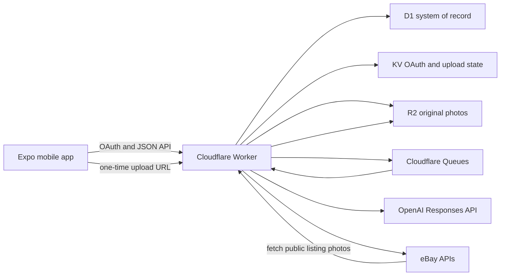

# Architecture

<!-- CURRENT-STATE-AUTHORITY -->
> **Accuracy note, July 21, 2026:** Source architecture includes RevenueCat trust boundaries and D1-backed Market beta resources. See [Current Implementation State](./CURRENT_STATE.md) for the authoritative implementation and deployment snapshot.

## Design Goals

ListingOS optimizes for the shortest safe path from product photos to a live eBay listing:

1. The seller selects photos and a speed-versus-profit preference.
2. The app creates a batch and immediately shows optimistic upload progress.
3. Cloudflare processes product groups and AI drafts asynchronously.
4. The seller reviews one page where optional fields remain collapsed.
5. The Worker verifies eBay requirements before accepting a publish job.
6. The app polls the idempotent publish attempt until eBay returns a result.

The default is AI-selected data with seller overrides, not an empty listing form.

## System Overview

## Mobile Architecture

### Routes

| Route | Screen | Responsibility |
| --- | --- | --- |
| `/` | `DashboardScreen` | eBay connection, photo selection, pricing preference, and batch creation |
| `/batches/[batch-id]` | `BatchDetailScreen` | optimistic upload progress and background job monitoring |
| `/drafts/[draft-id]` | `DraftDetailScreen` | pricing, optional edits, blockers, verification, and publish result |

### State boundaries

- TanStack Query owns server state, polling, cache updates, retries, and optimistic rollback.
- Component state owns unsaved form values and progressive-disclosure controls.
- SecureStore holds the seven-day app session token.
- AsyncStorage holds only non-sensitive convenience state such as the last batch ID.
- `src/shared/contracts.ts` validates every important response at the client boundary.

### Network behavior

- Requests time out after 30 seconds.
- Queries retry retryable network, timeout, rate-limit, and server failures up to two times.
- Mutations do not retry automatically because they may change marketplace state.
- Query focus follows React Native `AppState`; reconnects refresh eligible queries.
- Uploads run with concurrency four and update progress after each completed photo.

### Rendering and accessibility

- `AppScreen` centralizes safe areas, responsive gutters, keyboard avoidance, focused-input reveal, and persistent footer clearance.
- Android uses translucent glass surfaces instead of repeated native blur surfaces on scrolling screens.
- iOS retains native `BlurView` rendering.
- Buttons and segmented controls expose accessibility roles, labels, states, and minimum touch targets.
- The review screen uses progressive disclosure so only pricing and required blockers are prominent by default.

## Worker Architecture

The Worker is both an HTTP service and a Queue consumer.

### HTTP responsibilities

- create and complete eBay OAuth sessions
- authenticate mobile app sessions
- create upload batches and one-time upload URLs
- serve R2 photos through a stable public route
- expose draft jobs and draft editing
- inspect and resolve seller/listing blockers
- verify and enqueue eBay publishing
- return publish status and buyer-facing URLs

### Queue responsibilities

| Message | Producer | Consumer behavior |
| --- | --- | --- |
| `process_upload_batch` | `POST /api/drafts/jobs` | clusters batch photos and creates one draft job per product group |
| `generate_draft` | upload-batch processor | loads R2 images, calls OpenAI/eBay, builds pricing, and persists a draft |
| `publish_listing` | publish route | claims an idempotent attempt, builds the Inventory API payload, and publishes |

Queue messages are acknowledged only after successful processing. Failures are retried. Publish claims use a conditional D1 status update so duplicate consumers do not publish the same attempt twice.

## Data Model

| Table | Purpose |
| --- | --- |
| `users` | normalized seller identity |
| `seller_accounts` | eBay account and encrypted OAuth tokens |
| `auth_sessions` | temporary OAuth handoff state and result |
| `app_sessions` | bearer sessions used by the mobile app |
| `seller_marketplace_settings` | policy IDs and inventory location per marketplace |
| `upload_batches` | seller photo-selection batch |
| `batch_photos` | R2 object metadata |
| `draft_jobs` | asynchronous AI generation state |
| `draft_job_photos` | job-to-photo mapping |
| `drafts` | validated listing payload and status |
| `blockers` | required seller or listing corrections |
| `publish_attempts` | idempotent eBay mutation record and response |
| `app_events` | reserved audit/event storage |

The full schema is in `worker/migrations/0001_initial.sql`.

## External Integrations

### OpenAI

The draft generator uses the Responses API with product images and a strict structured output schema. The default model constant is `gpt-5.6-luna`, with `OPENAI_DRAFT_MODEL` or `OPENAI_MODEL` available as environment overrides. The model proposes titles, category text, condition, description, specifics, pricing context, listing mode, and an enhancement plan. Zod validates the Worker’s final public payload.

### eBay

- Identity API identifies the connected seller.
- Account API reads and can create business policies.
- Inventory API manages inventory items, offers, and fixed-price publishing.
- Taxonomy API suggests categories and required aspects.
- Browse API supplies active comparable listings.

Public photos use `GET /api/public/photos/:photoId`. This route is intentionally unauthenticated because eBay must fetch the image from outside the seller session.

## Publish Safety

- The app saves the latest edits before verification.
- The Worker verifies again inside the publish endpoint.
- A draft with blockers returns HTTP 409 and is not queued.
- Existing queued, publishing, or published attempts are returned instead of creating duplicates.
- The Queue consumer conditionally claims only a queued attempt.
- A successful response persists eBay offer/listing identifiers and the buyer-facing URL.

## Known Architectural Gaps

- The binary photo upload is client-driven and is not resumable after process termination.
- D1 stores the full draft as JSON in addition to indexed summary columns; future analytics may warrant normalized draft fields.
- The Worker is intentionally still a single orchestration module. Split by auth, media, AI, eBay, and publishing once route-level tests exist to protect behavior during extraction.
- The app has no offline mutation queue.
- Auction support needs a dedicated Trading API adapter and end-to-end tests before being treated as production-ready.
- Public OAuth initiation, health, upload-token, and photo routes do not yet have dedicated rate limiting or abuse controls.
- App session IDs are opaque bearer tokens stored directly in D1. A hardened public release should store only a token hash and support explicit revocation/rotation.

<!-- CURRENT-ARCHITECTURE-2026-07-21 -->
## Current Architecture Addendum

The Expo app owns routes and screen orchestration; src/shared/contracts.ts is the mobile/Worker contract source of truth. The Cloudflare Worker owns eBay OAuth/publishing, AI/queue orchestration, server-authoritative billing, uploads, public photos, and Market beta HTTP behavior.

D1 Market migrations create buyer identities/sessions, public listings, threads, messages, blocks, reports, and rate events. The web app provides public /market and listing-detail routes. Native seller inbox/reply UX is not part of the current implementation.

RevenueCat has separate trust paths: native public SDK keys by platform, hosted purchase links on web, and Worker-only REST/webhook credentials. Never infer entitlements from client state alone.
