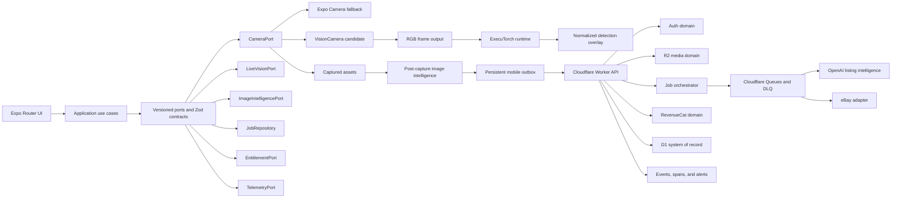
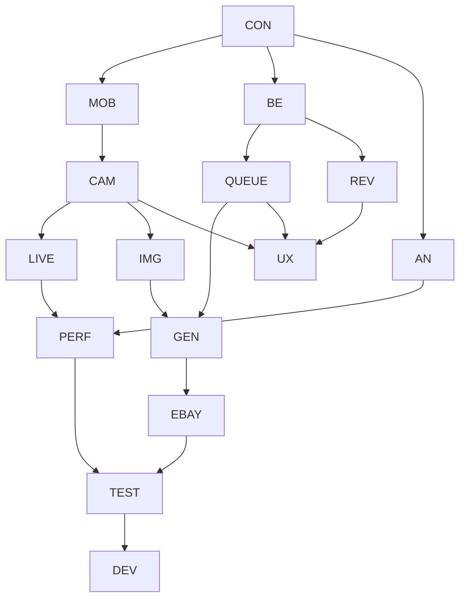

# ListingOS Engineering Execution Plan

## Purpose

This document defines the interface-first delivery plan for evolving ListingOS into a production-quality, camera-first eBay listing application while allowing 10 or more engineers or coding agents to work in parallel.

The immediate Build Week submission remains on the current proven Expo Camera path. VisionCamera and React Native ExecuTorch are post-submission, feature-flagged migrations that must pass native compatibility, capture parity, performance, thermal, and physical-device gates before becoming the default.

## Operating Principles

- Keep `src/shared/contracts.ts` as the mobile/Worker contract source of truth.
- Land interfaces and fixtures before implementations.
- Preserve the current Expo Camera implementation as a production fallback.
- Keep live detection advisory. OCR, marketplace evidence, server validation, and seller review remain authoritative.
- Keep fixed-price eBay Inventory API publishing as the only production-claimable publish path until other adapters are verified.
- Use small PRs, directory ownership, and one daily integration train.
- Do not combine native camera migration, UI redesign, and backend extraction in one PR.
- Do not use live eBay publishing as a routine test.

## High-Level Architecture



## Compatibility Gate

ListingOS currently uses Expo SDK 57, React Native 0.86, patched `expo-camera`, and an experimental YOLOX path. The published React Native ExecuTorch compatibility table currently documents React Native support through 0.85 and Expo resource-fetcher support through Expo SDK 55. Sprint 0 must therefore prove the exact native combination before feature work proceeds.

VisionCamera v5 and React Native ExecuTorch integrate through RGB frame outputs and worklets. ExecuTorch requires RGB for this integration, while VisionCamera documents the memory and bandwidth cost of converting native YUV camera buffers to RGB. The RGB frame output must only be attached while live assistance is enabled, use a constrained resolution and inference cadence, drop frames while busy, and always dispose frame buffers.

References:

- [React Native ExecuTorch compatibility](https://docs.swmansion.com/react-native-executorch/docs/other/compatibility)
- [React Native ExecuTorch VisionCamera integration](https://docs.swmansion.com/react-native-executorch/docs/hooks/computer-vision/visioncamera-integration)
- [VisionCamera frame output](https://visioncamera.margelo.com/docs/frame-output)
- [VisionCamera performance](https://visioncamera.margelo.com/docs/performance)
- [Expo custom native code](https://docs.expo.dev/workflow/customizing/)

## Shared Interfaces

```ts
interface CameraPort {
  capabilities(): Promise<CameraCapabilities>;
  start(config: CameraConfig): Promise<CameraSession>;
  focus(point: NormalizedPoint): Promise<FocusResult>;
  capture(request: CaptureRequest): Promise<CapturedAsset>;
  stop(): Promise<void>;
}

interface LiveVisionPort {
  load(manifest: ModelManifest): Promise<void>;
  setPolicy(policy: InferencePolicy): void;
  analyze(frame: FrameHandle): DetectionSet | null;
  unload(): Promise<void>;
}

type JobEnvelope = {
  jobId: string;
  type: "process_batch" | "analyze_images" | "generate_draft" | "publish";
  schemaVersion: number;
  idempotencyKey: string;
  attempt: number;
  createdAt: string;
  payload: unknown;
};
```

Canonical coordinates are normalized from `0` to `1`, capture-oriented, and unmirrored. Camera, model, and overlay adapters own all coordinate conversion.

## Parallel Workstreams

### CON: Contracts And Architecture

- **Objective:** Define ports, schemas, state machines, event names, and compatibility fixtures before implementation.
- **Owner:** Staff architect and contract steward.
- **Complexity:** High.
- **Dependencies:** None.
- **Contracts and models:** `CameraPort`, `LiveVisionPort`, `JobEnvelope`, `JobEvent`, `EntitlementSnapshot`, `AnalyticsEvent`, schema-version policy.
- **Interfaces:** Mobile and Worker Zod schemas with fixture producers and consumers.
- **Success criteria:** Every cross-boundary payload is validated and versioned.
- **Acceptance tests:** Mobile and Worker parse the same fixtures; old fixtures remain readable.
- **Risks:** Becoming a review bottleneck.
- **Future:** Extract a separately versioned contracts package and generated API documentation.

### MOB: Mobile Platform

- **Objective:** Separate navigation, application use cases, server state, local state, dependency injection, permissions, and feature flags.
- **Owner:** Mobile platform lead.
- **Complexity:** High.
- **Dependencies:** CON.
- **Contracts and models:** `AppServices`, `FeatureFlagSnapshot`, `PermissionState`, `NavigationIntent`.
- **Interfaces:** Router routes call view models; TanStack Query remains server-state owner; services are injectable.
- **Success criteria:** Routes contain no business logic and all native capabilities can be replaced by fakes.
- **Acceptance tests:** App starts with every permission denied; offline flags and kill switches work; navigation intents are deterministic.
- **Risks:** Premature abstraction.
- **Future:** Remote experiment allocation and seller-specific workflow presets.

### CAM: Camera Platform

- **Objective:** Own VisionCamera evaluation, camera lifecycle, frame outputs, capture, autofocus, exposure, flash, torch, zoom, orientation, and memory.
- **Owner:** Android and iOS camera leads.
- **Complexity:** Extra large.
- **Dependencies:** CON and MOB.
- **Contracts and models:** `CameraCapabilities`, `CameraSessionState`, `CameraConfig`, `CapturedAsset`, `FocusResult`.
- **Interfaces:** `ExpoCameraAdapter` and feature-flagged `VisionCameraAdapter` implement `CameraPort`.
- **Success criteria:** Capture parity on Galaxy A16 and the target iPhone with immediate fallback.
- **Acceptance tests:** Background/foreground, interruption, rotation, camera switch, permission changes, focus, flash, and 100-capture soak.
- **Risks:** Native incompatibility, OEM camera differences, and regressions to the proven capture path.
- **Future:** RAW, depth, multi-camera, and external camera adapters.

### LIVE: Live On-Device AI

- **Objective:** Build model loading, lifecycle, frame scheduling, frame dropping, adaptive FPS, object detection, overlays, thermal policy, battery policy, and quality modes.
- **Owner:** Edge ML team.
- **Complexity:** Extra large.
- **Dependencies:** CAM, CON, and PERF.
- **Contracts and models:** `ModelManifest`, `FrameEnvelope`, `InferencePolicy`, `DetectionSet`, `DeviceHealthSnapshot`; additive `model_manifests` and `device_profiles` storage if server control is needed.
- **Interfaces:** `LiveVisionPort`, `DeviceHealthPort`, and `CoordinateTransform`.
- **Success criteria:** Live assistance never blocks capture and can be disabled instantly.
- **Acceptance tests:** Overlay golden tests for rotation/mirroring; frame-disposal soak; A16 latency, memory, battery, and thermal tests.
- **Risks:** RGB conversion cost, model size, unsupported native combination, and camera-pipeline stalls.
- **Future:** Quantized seller-object models and device-specific model selection.

### IMG: Post-Capture Image Intelligence

- **Objective:** Run OCR, barcode detection, embeddings, duplicate detection, blur analysis, quality scoring, segmentation, and image validation after capture.
- **Owner:** Image intelligence team.
- **Complexity:** Extra large.
- **Dependencies:** CON and CAM capture assets.
- **Contracts and models:** `ImageIntelligenceRequest`, `ImageIntelligenceResult`, `ImageArtifact`, `DuplicateCluster`; additive `image_analysis` records.
- **Interfaces:** `ImageIntelligencePort` with independently enabled processors.
- **Success criteria:** Processing starts after capture while the seller immediately begins the next product.
- **Acceptance tests:** Fixed image corpus, latency and memory budgets, cancellation, duplicate fixtures, and immutable-original checks.
- **Risks:** OCR latency, model downloads, and false duplicate decisions.
- **Future:** Vertical-specific OCR and approved background-cleaned variants.

### GEN: AI Listing Generation

- **Objective:** Own OpenAI structured outputs, prompt registry, retries, validation, confidence, evidence provenance, and hallucination safeguards.
- **Owner:** AI platform lead.
- **Complexity:** High.
- **Dependencies:** CON, IMG, and BE.
- **Contracts and models:** `ListingGenerationRequest`, `ListingCandidate`, `EvidenceRef`, `ConfidenceDecision`, prompt and schema versions.
- **Interfaces:** Provider-neutral `ListingGenerator`; mobile receives stage progress, not raw token streaming.
- **Success criteria:** Invalid model output never persists and low-confidence identity requires review.
- **Acceptance tests:** Malformed responses, timeout/retry/idempotency, prompt regression corpus, and evidence-threshold tests.
- **Risks:** Prompt drift, model variance, and unsupported factual claims.
- **Future:** Evaluation-driven model routing and provider fallback.

### BE: Worker Platform

- **Objective:** Split `worker/index.ts` into auth, media, jobs, AI, eBay, billing, and telemetry modules behind one initial Worker deployment.
- **Owner:** Backend lead.
- **Complexity:** Extra large.
- **Dependencies:** CON and TEST characterization coverage.
- **Contracts and models:** Existing API schemas plus token hashes, revocation, rate-limit records, repositories, and route services.
- **Interfaces:** Hono routes depend on domain services rather than direct D1/eBay/OpenAI calls.
- **Success criteria:** Behavior remains stable while modules become independently testable.
- **Acceptance tests:** Route parity, public-photo reachability, authentication, abuse controls, load tests, and secret scanning.
- **Risks:** Refactor regressions and hidden coupling.
- **Future:** Independently deployed heavy consumers only after operational need is proven.

### EBAY: Marketplace Adapter

- **Objective:** Own OAuth, token refresh, taxonomy, policies, media, fixed-price creation, revision, publishing, pricing evidence, failures, and retries.
- **Owner:** Marketplace integration lead.
- **Complexity:** Extra large.
- **Dependencies:** BE and CON.
- **Contracts and models:** `EbayGateway`, `ListingMutation`, `PublishResult`, `MarketplaceError`; preserve `publish_attempts` idempotency.
- **Interfaces:** Provider adapter isolates eBay-specific payloads from listing-domain models.
- **Success criteria:** Duplicate consumers cannot create duplicate listings and errors produce actionable blockers.
- **Acceptance tests:** Fixtures, sandbox tests, token expiration, policy absence, media failure, throttling, and duplicate delivery.
- **Risks:** API throttling, policy variance, and accidental production mutations.
- **Future:** Dedicated auction and additional marketplace adapters.

### QUEUE: Async Jobs And Offline Outbox

- **Objective:** Let sellers continue immediately while uploads, intelligence, generation, and publishing run durably.
- **Owner:** Distributed systems lead.
- **Complexity:** Extra large.
- **Dependencies:** CON and BE.
- **Contracts and models:** `JobEnvelope`, `JobState`, `JobEvent`, `OutboxMutation`; additive `job_runs`, `job_events`, and `job_attempts`; local persistent outbox.
- **Interfaces:** `JobRepository`, `OutboxRepository`, progress polling/push, cancel and retry commands.
- **Success criteria:** Process termination, network loss, and duplicate delivery do not lose or duplicate work.
- **Acceptance tests:** Kill during upload, reconnect, dedupe, delayed retry, cancel before irreversible publish, DLQ replay, and reconciliation.
- **Risks:** Client/server state divergence and unclear cancellation boundaries.
- **Future:** Event streaming and multi-region processing.

Cloudflare queue consumers must use delayed retries and a dead-letter queue. Messages that exhaust retries without a configured DLQ can be discarded.

- [Cloudflare queue retries](https://developers.cloudflare.com/queues/configuration/batching-retries/)
- [Cloudflare dead-letter queues](https://developers.cloudflare.com/queues/configuration/dead-letter-queues/)

### REV: Revenue And Entitlements

- **Objective:** Own RevenueCat subscriptions, onboarding, entitlements, paywalls, upgrades, restore flow, feature gating, and usage reservations.
- **Owner:** Monetization lead.
- **Complexity:** High.
- **Dependencies:** CON and BE.
- **Contracts and models:** `EntitlementSnapshot`, `UsageReservation`, `UsageCommit`; existing billing and usage tables remain authoritative.
- **Interfaces:** `EntitlementPort` on mobile and server-side entitlement enforcement.
- **Success criteria:** A modified client cannot bypass paid feature or usage limits.
- **Acceptance tests:** Test/App/Play catalogs, webhook replay, purchase, restore, expiration, grace period, and server rejection.
- **Risks:** Store-specific catalog drift.
- **Future:** Credit packs, team subscriptions, and seller-volume plans.

### AN: Analytics And Observability

- **Objective:** Track listing completion, camera use, inference timing, AI latency/cost, friction, conversion, crashes, and publish outcomes.
- **Owner:** Data and observability lead.
- **Complexity:** High.
- **Dependencies:** CON; otherwise parallel.
- **Contracts and models:** `AnalyticsEvent`, `TraceContext`, `PerformanceSample`; extend `app_events` and `ai_operation_events` without raw prompts or images.
- **Interfaces:** `TelemetryPort` with mobile and Worker sinks.
- **Success criteria:** One trace connects capture, upload, generation, review, and publish without exposing secrets.
- **Acceptance tests:** Event-schema validation, privacy review, funnel dashboard, cost reconciliation, and synthetic alert tests.
- **Risks:** Sensitive payloads and high-cardinality dimensions.
- **Future:** Warehouse export, cohorts, and model-quality dashboards.

### PERF: Performance Engineering

- **Objective:** Own startup, memory, bundle size, battery, CPU/GPU, thermal behavior, FPS, rendering, inference, and networking budgets.
- **Owner:** Performance lead.
- **Complexity:** Extra large.
- **Dependencies:** Cross-cutting.
- **Contracts and models:** `DeviceProfile`, `PerformanceBudget`, `PerformanceSample`.
- **Interfaces:** Repeatable benchmark harness and release-readable result artifact.
- **Success criteria:** Both target devices pass sustained camera and queue workflows.
- **Acceptance tests:** 5, 15, and 30-minute profiles; 100 captures; cold/warm startup; constrained network; background/resume.
- **Risks:** Lab results may not represent field devices.
- **Future:** Fleet-derived adaptive device profiles.

### UX: Product Experience

- **Objective:** Independently deliver onboarding, capture, queue, review, publishing, subscription, errors, loading states, and motion.
- **Owner:** Product design and UI team, split by flow.
- **Complexity:** Extra large.
- **Dependencies:** Stable MOB, QUEUE, and REV view models.
- **Contracts and models:** View-state models only; presentation components do not call backend services directly.
- **Interfaces:** Screen-level view models and reusable design-system components.
- **Success criteria:** Every flow has success, loading, empty, offline, error, retry, and accessibility behavior.
- **Acceptance tests:** Visual matrix, screen-reader checks, reduced motion, touch targets, snapshots, and flow E2E.
- **Risks:** Parallel edits to shared screens and style files.
- **Future:** Personalization and high-volume seller modes.

### TEST: Quality Engineering

- **Objective:** Establish unit, integration, E2E, camera, AI regression, Worker, API mock, performance, and physical-device testing.
- **Owner:** QA automation lead.
- **Complexity:** Extra large.
- **Dependencies:** Starts immediately.
- **Contracts and models:** Fake ports, route fixtures, image/model corpus, marketplace fixtures, and device test manifests.
- **Interfaces:** Test harnesses mirror production ports and never require routine live marketplace mutations.
- **Success criteria:** Every critical state machine and adapter has deterministic coverage.
- **Acceptance tests:** CI runs cleanly from a fresh clone and produces logs, screenshots, traces, and benchmark artifacts.
- **Risks:** Limited automation of real camera optics and store environments.
- **Future:** Device-farm coverage and automated visual/performance regression.

### DEV: DevOps And Release

- **Objective:** Own CI/CD, environments, flags, monitoring, crash reporting, native builds, staged releases, and rollback.
- **Owner:** DevOps/SRE.
- **Complexity:** High.
- **Dependencies:** TEST and AN.
- **Contracts and models:** `ReleaseManifest`, environment schema, feature-flag manifest, build/runtime compatibility matrix.
- **Interfaces:** Reproducible EAS/native and Worker pipelines with environment-specific secrets.
- **Success criteria:** Every release is traceable, staged, monitored, and reversible.
- **Acceptance tests:** Clean-clone build, secret scan, environment drift, staged rollout, health gate, and rollback rehearsal.
- **Risks:** Store delays, native build cost, and incompatible OTA/native runtime combinations.
- **Future:** Canary automation and update-health gating.

## Dependency Graph



## Critical Paths

### Camera And Edge AI

1. Native compatibility spike.
2. `CameraPort` and existing Expo Camera adapter.
3. VisionCamera capture parity.
4. Galaxy A16 baseline and model benchmark.
5. ExecuTorch model lifecycle and scheduling.
6. Adaptive inference and overlays.
7. Device, thermal, memory, and battery QA.
8. Staged native release.

### Listing Pipeline

1. Contract and characterization tests.
2. Worker domain extraction.
3. Durable job ledger and dead-letter queue.
4. Post-capture intelligence.
5. Structured listing generation and validation.
6. Idempotent eBay adapter hardening.
7. Integration and failure-recovery QA.

These paths run concurrently. Production promotion waits for both. The Build Week release does not wait for either migration.

## Parallel Timeline

| Phase | Duration | Parallel work |
| --- | --- | --- |
| Build Week freeze | Through July 21 | Existing camera stabilization, iOS focus, theme fix, integrated QA, demo, and submission only |
| Sprint 0 | 5 days | Contracts, test harness, compatibility spikes, target-device baselines, Worker characterization tests |
| Sprint 1 | 2 weeks | Camera adapter, Worker extraction, event taxonomy, flags, mobile view-model extraction |
| Sprint 2 | 2 weeks | VisionCamera parity, post-capture intelligence, durable queue/outbox, server entitlement gates |
| Sprint 3 | 2 weeks | ExecuTorch detection, overlays, OpenAI regression harness, eBay hardening |
| Sprint 4 | 2 weeks | Thermal modes, complete UX states, E2E/device matrix, monitoring, release automation |
| Sprint 5 | 1 week | Soak tests, staged rollout, rollback rehearsal, production-readiness review |

## Engineering Tickets And Definition Of Done

| Workstream | Tickets | Definition of Done for each ticket |
| --- | --- | --- |
| CON | `CON-1` ports; `CON-2` job/events; `CON-3` fixtures | Schema, types, producer/consumer tests, migration notes, and backward-compatibility fixture |
| MOB | `MOB-1` services; `MOB-2` view models; `MOB-3` permissions/flags | Fake test, denied-state UX, no route business logic, and demonstrated rollback |
| CAM | `CAM-1` Expo adapter; `CAM-2` VisionCamera spike; `CAM-3` parity; `CAM-4` lifecycle | Native compile, 100-capture soak, interruption matrix, and focus/orientation evidence |
| LIVE | `LIVE-1` model manager; `LIVE-2` scheduler; `LIVE-3` overlays; `LIVE-4` governor | A16 benchmark, frame disposal, frame dropping, coordinate tests, and kill switch |
| IMG | `IMG-1` quality/barcode; `IMG-2` OCR; `IMG-3` embeddings/dedup; `IMG-4` segmentation | Corpus metrics, latency/memory report, cancellation, and immutable-original proof |
| GEN | `GEN-1` prompts; `GEN-2` structured adapter; `GEN-3` confidence/evidence; `GEN-4` evals | Versioned schema, malformed-output tests, retry tests, and regression threshold report |
| BE | `BE-1` route tests; `BE-2` extraction; `BE-3` auth; `BE-4` limits/cache | Worker checks, route parity, threat review, load test, and no public-photo regression |
| EBAY | `EBAY-1` OAuth; `EBAY-2` taxonomy/policies; `EBAY-3` media; `EBAY-4` publish/revise | Fixtures and sandbox tests, idempotency proof, typed errors, and no routine live mutation |
| QUEUE | `Q-1` ledger; `Q-2` queues/DLQ; `Q-3` outbox; `Q-4` cancel/retry | Process-kill recovery, duplicate delivery, delayed retry, DLQ replay, and cancellation proof |
| REV | `REV-1` entitlements; `REV-2` webhook; `REV-3` paywall; `REV-4` usage | Store catalog checks, webhook replay, server enforcement, and restore E2E |
| AN | `AN-1` event dictionary; `AN-2` traces/cost; `AN-3` dashboards/alerts | Schema validation, privacy review, funnel dashboard, and synthetic alert |
| PERF | `P-1` harness; `P-2` baseline; `P-3` governor; `P-4` release budgets | Repeatable reports on both targets and machine-readable pass/fail artifact |
| UX | `UX-1` through `UX-9` for each product flow | Every flow includes all lifecycle states, analytics, accessibility, snapshot, and E2E coverage |
| TEST | `T-1` unit; `T-2` Worker; `T-3` E2E; `T-4` AI corpus; `T-5` devices | Tests are deterministic, documented, CI-runnable, and non-mutating by default |
| DEV | `D-1` CI; `D-2` environments; `D-3` monitoring; `D-4` release | Clean-clone build, secret scan, staged release, health gate, rollback, and runbook |

## Initial Performance Budgets

These are release targets, not current claims. Sprint 0 must record the baseline and adjust only with written evidence.

- Galaxy A16: stable 30 FPS preview, less than 2 percent preview-frame loss over 10 minutes, and 1 to 2 FPS live inference initially.
- Target iPhone: stable 30 FPS in balanced mode and optional 60 FPS only when device and thermal conditions allow it.
- Both: camera first frame under 1.5 seconds, capture feedback under 100 ms, and no more than 20 MB steady-state memory growth during a 10-minute loop.
- Galaxy A16: capture-to-thumbnail under 700 ms.
- Target iPhone: capture-to-thumbnail under 400 ms.
- Thermal policy: `quality -> balanced -> saver -> disabled`, with conservative recovery.
- Start live detection with the smallest validated detector, likely SSDLite 320. Do not run continuous OCR, segmentation, or embeddings.

## Merge Order

1. Contracts and fixtures.
2. Feature flags, telemetry, and port definitions.
3. Existing implementation adapters with no behavior change.
4. Worker characterization tests and domain extraction.
5. VisionCamera compile spike without UI redesign.
6. Platform-specific capture parity.
7. Post-capture intelligence modules.
8. Job ledger, DLQ, and mobile outbox.
9. ExecuTorch model manager and offline benchmark.
10. Live scheduling and overlays.
11. OpenAI, eBay, and revenue hardening.
12. UX flows against stable view models.
13. Performance gates, E2E, monitoring, and release configuration.

PRs should stay under roughly 400 net lines when practical. Shared-contract changes land separately before implementation PRs. One integration owner resolves lockfile and generated native-project conflicts.

## Top Risks And Mitigations

| Risk | Mitigation |
| --- | --- |
| ExecuTorch does not compile cleanly with RN 0.86/Expo 57 | Five-day spike, upstream report if needed, and retain existing detector/camera |
| RGB inference overloads Galaxy A16 | 320px model, 1 to 2 FPS, frame dropping, and no continuous OCR/segmentation |
| VisionCamera regresses capture | Adapter parity, kill switch, existing fallback, and staged device rollout |
| Worker refactor breaks publishing | Characterization tests before extraction and preservation of idempotency/public photos |
| Queue redelivery creates duplicate listings | Conditional D1 claim, idempotency key, and immutable publish attempt |
| Offline state diverges | Durable outbox plus authoritative server state and reconciliation |
| AI invents identity or pricing | Evidence provenance, confidence gates, deterministic validation, and seller confirmation |
| RevenueCat client is spoofed | Worker-authoritative entitlement and usage reservation |
| Parallel agents collide | Directory ownership, contract steward, small PRs, and daily merge train |
| Product claims exceed evidence | Device and marketplace evidence required before promotion |

## Recommended AI-Agent Assignment Order

1. Contract steward.
2. Worker characterization-test agent.
3. VisionCamera/ExecuTorch compatibility agent.
4. Galaxy A16 and iPhone performance agents.
5. Mobile architecture and dependency-injection agent.
6. Android and iOS camera agents.
7. Backend domain-extraction agent.
8. Queue and offline-outbox agent.
9. Image-intelligence agents.
10. OpenAI evaluation and structured-output agent.
11. eBay hardening agent.
12. RevenueCat agent.
13. Analytics and observability agent.
14. UI agents split by product flow.
15. QA, E2E, and release agents.

## Promotion Rule

VisionCamera or ExecuTorch becomes the default only when all of the following are true:

1. The exact Expo 57 and React Native 0.86 native build compiles reproducibly.
2. Existing capture behavior reaches parity on both target devices.
3. Camera, AI, memory, thermal, battery, and orientation suites pass.
4. The fallback path remains remotely selectable.
5. The integrated release passes the complete non-mutating QA matrix.

